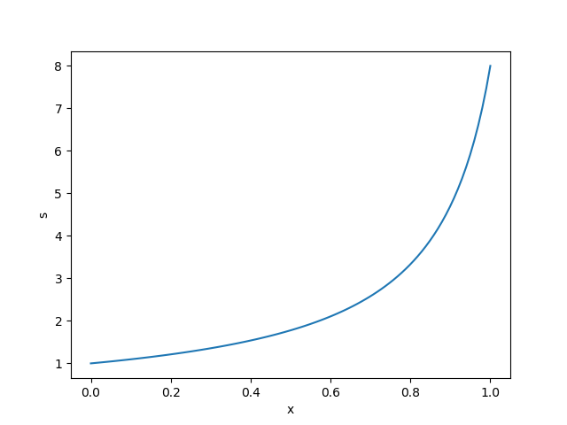
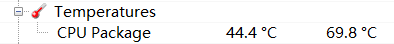
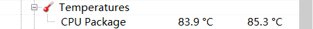

# 第二章习题

## 1

在3台不同指令系统的计算机上运行同一程序P时，

A机需要执行$1.0\times 10^8$条指令，

B机需要执行$2.0\times 10^8$条指令，

C机需要执行$4.0\times 10^8$条指令，

但实际执行时间都是10s。

请分别计算这3台机器在运行程序P时的实际速度，以MIPS为单位。

这3台计算机在运行程序P时，哪一台性能最高？为什么？


$$
V_1=\frac{1.0\times 10^8}{10\times 10^6}=10\ MIPS\\
V_2=\frac{2.0\times 10^8}{10\times 10^6}=20\ MIPS\\
V_3=\frac{4.0\times 10^8}{10\times 10^6}=40\ MIPS
$$
将“完成一个任务需要的时间”作为性能的最本质的定义，则这3台计算机在运行程序P时**性能相同**。

## 2

如果要给标量处理器增加向量运算部件，并且假定向量模式的运算速度是标量模式的**8倍**，这里把程序中可向量化部分运算量占总运算量的百分比称为**向量化百分比**。
* 画出一张图来表示加速比和向量化百分比的关系，X轴为向量化百分比，Y轴为加速比。
* 向量化百分比为多少时，加速比能达到2？当加速比达到2时，向量模式运行时间占总运行时间的百分之多少？
* 假设程序的向量化百分比为$70\%$，如果需要继续提升处理器的性能，一种方法是增加硬件成本将向量部件的速度提高一倍，另外一种方法是通过改进编译器来提高程序中向量模式的百分比，那么需要提升多少向量化百分比才能得到与向量部件运算速度提高一倍相同的性能？你推荐哪一种设计方案？


记加速比为$S$，向量化百分比为$X(0\le X\le 1)$。
$$
S=\frac{T_{scalar}}{T_{vec}}=\frac{1}{(1-X)+0.125\times X}\\
\therefore X=\frac{8}{7}(1-\frac{1}{S})
$$


$S=2$时，向量化百分比$X=4\div 7=57.14\%$。

此时向量模式运行时间占总运行时间的
$$
1-(\frac{3}{7}/\frac{1}{2})=\frac{1}{7}
$$


若向量部件的速度提高一倍，则
$$
S=\frac{1}{(1-0.7)+\frac{0.7}{16}}=\frac{32}{11}
$$
反之，若向量部件的速度不变，要达到相同加速比，需要的向量化百分比
$$
X=\frac{8}{7}(1-\frac{1}{S})=75\%
$$
即需要提升$5\%$向量化百分比。

推荐第二种方案。将向量运算部件速度提高一倍可能需要大量硬件成本，性价比不如优化编译器。


## 3

假设有一个代表典型应用的基准测试程序。一款不包含浮点部件的处理器（可以通过整数指令来模拟浮点指令）运行该基准程序的运行速度是**120 MIPS**，在该处理器上增加浮点协处理器后运行该基准测试程序的运行速度是**80 MIPS**。下面给出了一些参数：

* I——基准测试中整数指令的数目；
* F——基准测试中浮点指令的数目；
* Y——模拟一条浮点指令需要的整数指令的数目；
* W——无浮点协处理器时基准程序的运行时间；
* B——有浮点协处理器时基准程序的运行时间；

### (1)

用上面的参数符号表示出两种配置处理器的MIPS值。

模拟浮点：
$$
\frac{I+F\times Y}{W}
$$
有浮点协处理器：
$$
\frac{I+F}{B}
$$


### (2)

在没有协处理器的配置下，假定$F=8\times 10^6,Y=50,W=4 s$，求I的值。

代入上式(1)可得$I=8\times 10^7$

### (3)

在上述条件下，求B的值。

代入上式(2)可得$B=1.1 s$

### (4)

在包含协处理器的配置下，系统的`MFLOPS`是多少？
$$
MFLOPS=F/B=8/1.1=7.27
$$
==这里做错了==。MFLOPS应该使用浮点指令数除以**浮点部分所占时间**（总时间减去定点部分时间）来计算。
$$
MFLOPS=\frac{F\times10^{-6}}{B-\frac{W\times I}{I+F\times Y}}
$$


### (5)

你的同事想要购买这种协处理器来提高性能，而该配置下`MIPS`降低了，请问他的决策正确吗？解释你的观点。

`MIPS`不是衡量处理器性能的唯一标准。在增加浮点协处理器后，如果应用的运行时间减少了，则达到了提升性能的目的。

## 4

假设晶片成品率的经验公式如下：

$晶片成品率=(1+b\times 晶片面积/a)^{-a}$，其中$a=4$是衡量工艺复杂度的参数。

### (1)

假设采用12英寸（30 cm）的晶圆，每平方厘米晶圆的成本为$c=4000$，缺陷密度$b=0.6/cm^2$，利用电子表格，计算当晶片面积从$0.5cm^2$变化到$4cm^2$时晶片的成本。

然后，使用数学分析工具拟合出**晶片成本**和**面积**关系的多项式曲线，使其与电子表格中计算出来的数据相吻合。

### (2)

假设缺陷密度更高，$b=2.0/cm^2$，求最接近的最低次数的多项式。


使用课本上的公式可以得到晶片成本和面积的关系，然后代入数据即可。

## 5

对某处理器进行功耗测试，得到如下数据：

时钟不翻转，电压1.05 V时，电流为500 mA；

时钟频率为1 GHz，电压1.1 V时，电流为2500 mA。

请计算在1.1 V下，此处理器的静态功耗以及500 MHz下的总功耗。


这题是参考答案做的。

静态功耗：按电阻计算。（为什么分子上的电压是1.1不是1.05？）
$$
P=\frac{U^2}{R}=\frac{1.1\times1.1}{1.05/0.5}=0.576 W
$$
1.1 V，1 GHz时总功耗$1.1V\times 2.5 A=2.75 W$。

动态功耗=总功耗-静态功耗，故$P_v=2.75-0.576=2.174 W$。


动态功耗与翻转率成正比，故1.1 V，0.5 GHz时动态功耗$2.174/2=1.087 W$。

总功耗$1.087+0.576=1.663 W$

## 6

证明以下结论：

### (1)

N个正数的几何平均小于等于算术平均。

### (2)

用归一化的SPEC CPU 2000程序分值进行A、B两台计算机的性能比较与所使用的参考机无关。


这里比较的是两台机器的（几何平均）运行时间之比，参考机选择只影响分数的值，不影响A、B分数之比。

## 7

试讨论冯·诺依曼结构的主要特点。

### (1)

查阅资料，分别给出一款`Intel`、`AMD`、`IBM`商业处理器的峰值性能和访存带宽。

### (2)

分析这3款处理器的访存带宽和存储层次参数（一级cache大小和延迟、二级cache大小和延迟等）之间的关系。

## 8

在一台个人计算机上（如`Pentium 4`、`Core`、`Opteron`的CPU）

### (1)

查阅相关资料，给出该计算机的浮点运算峰值。

### (2)

编写一个汇编程序，尽量逼近该计算机的浮点峰值。


可以在循环中使用`x86`浮点运算指令，使得CPU进行大量浮点运算。但是浮点指令如何选择（+还是×）？有一篇关于[浮点峰值](https://zhuanlan.zhihu.com/p/28226956)的专栏文章。

> 浮点峰值的计算，一般是计算单位时间内，乘法和加法的最大总吞吐量，单位是GFLOPS或者TFLOPS，表示每秒钟计算乘法和加法的总次数。
>
> 乘法和加法可能涉及到的指令包括：单独的乘法指令，如`vmulps`；单独的加法指令，如`vaddps`；融合乘加指令，如`vfmadd231ps`等。后者将乘法和加法融合为一条指令，在多数处理器中，三种指令都可以在一个发射端口每周期发射一条，所以乘加指令往往比单独使用乘法或者加法带来翻倍的吞吐量。

### (3)

编写并运行一个1024×1024双精度矩阵乘法程序，计算出实际浮点运算速度。

## 9

简要描述一款主流的商业多核处理器结构，并指出其中指令级并行、数据级并行以及线程级并行的特点。


指令级并行：时间并行——指令流水线；空间并行——多发射。

数据级并行：单指令多数据流(SIMD)的向量结构。

线程级并行：多核、多线程处理器。

## 10

许多商业处理器（如`Intel`的`Core`系列，`AMD`的`Opteron`等）上都提供了温度传感器以获取芯片的内部温度。

### (1)

请编写一段程序，通过温度传感器来读取芯片温度。

Open Hardware Monitor是一个开源的硬件监测工具，它可以获取CPU的温度。

其中更新CPU温度的C#代码为：（适用Intel cpu）

```csharp
      for (int i = 0; i < coreTemperatures.Length; i++) {
        uint eax, edx;
        // if reading is valid
        if (Ring0.RdmsrTx(IA32_THERM_STATUS_MSR, out eax, out edx,
            cpuid[i][0].Affinity) && (eax & 0x80000000) != 0) 
        {
          // get the dist from tjMax from bits 22:16
          float deltaT = ((eax & 0x007F0000) >> 16);
          float tjMax = coreTemperatures[i].Parameters[0].Value;
          float tSlope = coreTemperatures[i].Parameters[1].Value;
          coreTemperatures[i].Value = tjMax - tSlope * deltaT;
        } else {
          coreTemperatures[i].Value = null;
        }
      }
```

这段程序从`Ring0.RdmsrTx`中读取了CPU的温度数据。

### (2)

请再编写一段程序，执行这段程序后可以显著提高芯片温度。

Google上说有的烤机程序是通过计算梅森素数使CPU温度增加的。

受此启发，我们编写一个简单的计算1~n的积的程序（程序计算出前100 0000个积后终止，不考虑计算出的数是否溢出）。

使用Open Hardware Monitor监测CPU温度。

运行前，温度在50℃左右。



运行过程中，温度超过了80℃。

