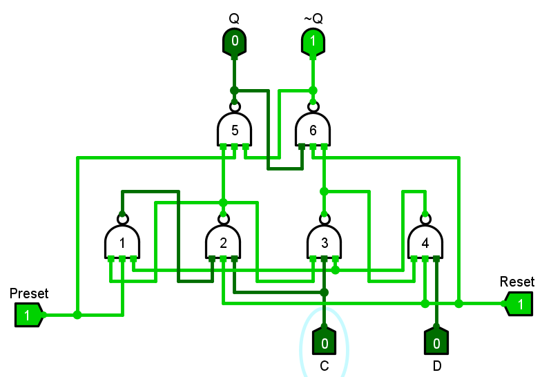
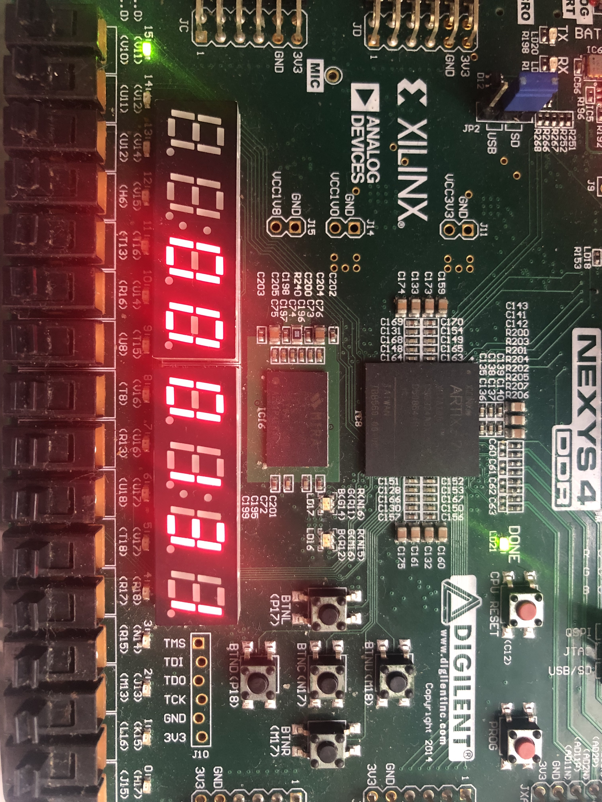

# 第三章习题

## 1

定点数的表示：

### (1)

分别给出64位定点原码和补码表示的数的范围；

|      | 最小值        | 最大值     |
| ---- | ------------- | ---------- |
| 原码 | $-(2^{63}-1)$ | $2^{63}-1$ |
| 补码 | $-2^{63}$     | $2^{63}-1$ |

### (2)

在32位定点补码表示中，`0x8000 0000`表示什么数？

$-2^{31}$

## 2

按照以下要求将浮点数表示出来。

### (1)

把单精度数转化为十进制数：`0x7ff 0000`，`0xbe40 0000`，`0xff80 0000`。

| 单精度数      | 符号位 | 阶码         | 尾数(2进制) | 十进制数             |
| ------------- | ------ | ------------ | ----------- | -------------------- |
| `0x7ff 0000`  | 0      | 15-127= -112 | 1.111 1111  | $255\times10^{-119}$ |
| `0xbe40 0000` | 1      | 124-127= -3  | 1.1         | $-0.1875$            |
| `0xff80 0000` | 1      | 255-127=128  | -           | $-\infty$            |

### (2)

把双精度数转化为十进制数：`0x4035 0000 0000 0000`，`0x8008 0000 0000 0000`。

| 双精度数                | 符号位 | 阶码        | 尾数(2进制) | 十进制数     |
| ----------------------- | ------ | ----------- | ----------- | ------------ |
| `0x4035 0000 0000 0000` | 0      | 1027-1023=4 | 1.0101      | $21$         |
| `0x8008 0000 0000 0000` | 1      | 0           | 0.1         | $-2^{-1023}$ |

### (3)

把十进制数转化为单精度数：-100.0，0.25。

| 十进制数 | 二进制表示         | 单精度数      |
| -------- | ------------------ | ------------- |
| -100.0   | $-1.1001\times2^6$ | `0xC2C8 0000` |
| 0.25     | $1\times 2^{-2}$   | `0x3e80 0000` |

### (4)

把十进制数转化为双精度数：1024.0，0.25。

| 十进制数 | 二进制表示       | 双精度数                |
| -------- | ---------------- | ----------------------- |
| 1024.0   | $1\times 2^{10}$ | `0x4090 0000 0000 0000` |
| 0.25     | $1\times 2^{-2}$ | `0x3fd0 0000 0000 0000` |


## 3

画出$e=a\&b|c\&d$的晶体管级电路图。


课本上已经有$\neg((a\and b)\or(c\and d))$电路图了，加一个反相器即可。

## 4

计算一个FO4的延迟，假设反相器的输入电容为0.0036 pF，平均每个负载连线电容为0.0044 pF，翻转延迟为0.023 ns，每pF延迟为4.5 ns。

（暂时不会）

## 5

分析下图的CMOS EDFF触发器（边沿触发的CMOS D触发器）的建立时间、保持时间和CLK→Q延迟。

假设反相器的延迟为1 ns，传输门从源到漏（或从漏到源）的延迟为0.5 ns，传输门从栅到漏（或源）的延迟为0.75 ns，不考虑由于latch的fight对反相器延迟的影响。

（暂时不会）

## 6

说明下图触发器的工作原理。

课本上的图不是很清楚（不知道哪里是交叉哪里是连接起来的）。对照答案的分析用`logisim`重画了一个书上的触发器。



首先忽略`Preset`和`Reset`输入（假定其恒为1），通过分析和仿真可知，C可以视为时钟信号，D视为输入，则此为一个D触发器。

当`Preset=0, Reset=1`时，Q=1。

当`Reset=0, Preset=1`时，Q=0。

当`Reset=Preset=0`时，Q=~Q=1，此为非法状态。


## 7

给出下图器件的逻辑表达式。

（暂时不会）

## 8

用`Verilog`写一个电子表电路。

```verilog
module timer(
	input reset,
	input clock,
    output [4:0] hour,
    output [5:0] minute,
    output [5:0] second
);
    /* Please insert your code here. */
endmodule
```


（代码见`ch3`文件夹下的`vivado`工程）

在`Nexys4 DDR`板子上实现了一个功能简陋的电子钟，只能顺序计时和重置。

```verilog
module timer(
    input reset,
    input clock,
    output reg [4:0] hour,
    output reg [5:0] minute,
    output reg [5:0] second
);
    /* Please insert your code here. */
    always @(posedge clock or posedge reset) begin
        if (reset) begin
            // reset
            hour <= 0;
            minute <= 0;
            second <= 0;
        end
        else begin
            second <= second + 1;
            if (second >= 59) begin
                minute <= minute + 1;
                second <= 0;
            end
            if (minute >= 59) begin
                hour <= hour + 1;
                minute <= 0;
            end
            if (hour >= 59) begin
                hour <= 0;
            end
        end
    end

endmodule
```

这里把`hour/minute/second`理解为二进制数字，后面将其转换为数码管输入的时候非常麻烦。

还有一个需要注意的问题，`second=59`时就应该进位，因为它是reg的输入，reg在下一拍输出才能能更新，`second=60`的时候更新已经晚了。

如何在8个七段数码管的控制输入接在一起的情况下显示不同的数字？这里只能逐个显示，如果切换速度合适，肉眼看起来就像同时显示了不同的数字。

```verilog
	always @(posedge refresh or posedge reset) begin
		if (reset) begin
			// reset
			AN <= 6'b111111;
		end
		else begin
			case (AN)
				6'b111110: begin
					C <= second_1;
					AN <= 6'b111101;
				end
				6'b111101: begin
					C <= minute_0;
					AN <= 6'b111011;
				end
				6'b111011: begin
					C <= minute_1;
					AN <= 6'b110111;
				end
				6'b110111: begin
					C <= hour_0;
					AN <= 6'b101111;
				end
				6'b101111: begin
					C <= hour_1;
					AN <= 6'b011111;
				end
				6'b011111: begin
					C <= second_0;
					AN <= 6'b111110;
				end
				default: begin
					AN <= 6'b111110;
				end
			endcase
		end
	end
```

效果：左边第一个LED每秒闪烁一次，指示`clock`信号，左边第一个开关用于复位。

