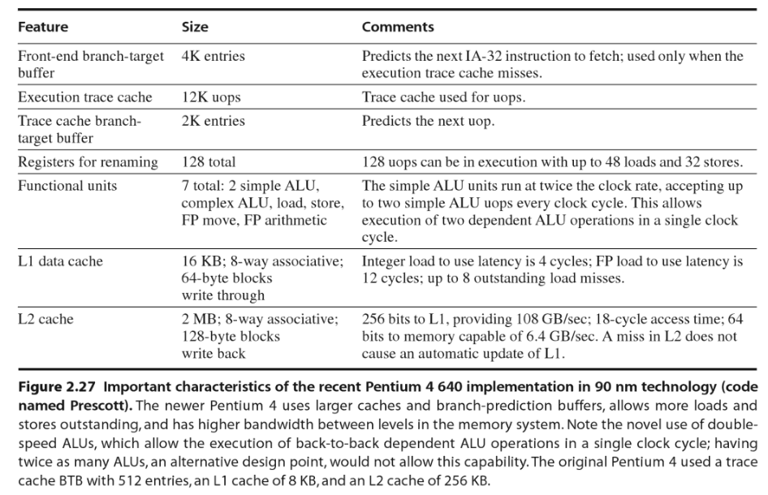
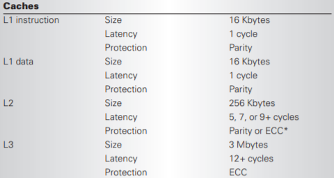

# 第四章习题

## 1

给定下面的代码片段：

```C
A = B - C;
D = A - C;
B = D + A;
```

### (1)

分别写出上述代码片段在4种指令系统类型（堆栈型、累加器型、寄存器-存储器型、寄存器-寄存器型）下的汇编语言代码。

假设A\B\C在以它们名字表示的内存单元中。

* 堆栈型

```assembly
PUSH B
PUSH C
SUB # TOP = B - C
POP A
PUSH A
PUSH C
SUB # TOP = A - C
POP D
PUSH D
PUSH A
ADD # TOP = D + A
POP B
```

* 累加器型

```assembly
LOAD B
SUB C
STORE A
SUB C
STORE D
ADD A
STORE B
```

* 寄存器-存储器型

```assembly
LOAD R1, B
SUB R1, C
STORE A, R1
SUB R1, C
STORE D, R1
ADD R1, A
STORE B, R1
```

* 寄存器-寄存器型

```assembly
LOAD R1, B
LOAD R2, C
SUB R3, R1, R2
STORE R3, A
SUB R4, R3, R2
STORE R4, D
ADD R1, R3, R4
STORE R1, B
```


### (2)

假设操作码占用8位编码，内存地址和操作数都是16位，寄存器型结构有16个通用寄存器。对每种结构回答以下问题：

1. 需要读取多少指令字节？
2. 与内存交换的数据有多少字节？
3. 依据代码量衡量哪种结构最好？
4. 依据与内存交换的数据（指令和数据）量衡量哪种结构最好？

|                  | 堆栈       | 累加器 | 寄存器-存储器 | 寄存器-寄存器  |
| ---------------- | ---------- | ------ | ------------- | -------------- |
| 读取指令字节     | 1×3+3×9=30 | 7×3=21 | 3.5×7=24.5    | 3.5×5+2.5×3=25 |
| 交换数据字节     | 9×2=18     | 4×2=8  | 4×2=8         | 5×2=10         |
| 代码量（行）     | 12         | 7      | 7             | 8              |
| 与内存交换总数据 | 48         | 29     | 32.5          | 35             |

依据代码量衡量——累加器/寄存器-存储器

依据与内存交换的数据（指令和数据）量衡量——累加器

## 2

十六进制数`0x4C4F 4F4E 4753 4F4E`要存在64位双字中。

### (1)

假设存储是8字节对齐的，请依据小尾端的格式将此十六进制数写入内存中，并将每个字节解释为一个ASCII字符写在对应的字节下边。

```
low addr							high addr
+----+----+----+----+----+----+----+----+
|0x4E|0x4F|0x53|0x47|0x4E|0x4F|0x4F|0x4C|
+----+----+----+----+----+----+----+----+
N	O	S	G	N	O	O	L
```


### (2)

按照大尾端的格式重做上题。

```
low addr							high addr
+----+----+----+----+----+----+----+----+
|0x4C|0x4F|0x4F|0x4E|0x47|0x53|0x4F|0x4E|
+----+----+----+----+----+----+----+----+
L	O	O	N	G	S	O	N
```


## 3

假定在指令系统设计中需要考虑两种条件转移指令的设计方法，这两种方法如下：

* CPU A：先通过一条比较指令设置条件码A，再用一条分支指令检测条件码。

* CPU B：比较操作包含在分支指令中。

在两种CPU中，条件转移指令都需要两个时钟周期，所有其他指令都需要一个时钟周期。

在CPU A中，全部指令的25%是条件转移指令，因为每次条件转移都需要一次比较，所以比较指令约占所有指令的25%。因为CPU A不需要在转移中包含分支，所以它的时钟频率是CPU B的1.2倍。

请问哪一种CPU性能更高？如果CPU A的时钟频率只是CPU B的1.1倍，结果又是多少？


这题的题意有点没懂。

如果A是两条指令实现，B是一条，又同样程序中A\B的CPI相同，则性能之比应该等于主频比吧，但是这样1.2和1.1答案就差不多了。

## 4

如果对通常的`MIPS`指令集增加寄存器-内存形式的指令，如下所示，可以减少一些`load`数量。

```assembly
LW R1, 0(R3)
ADD R2, R2, R1
```

可以合并成一条指令：

```assembly
ADD R2, 0(R3)
```

### (1)

给出一段符合上述例子的代码（`load`得到的值立即作为运算指令的源操作数），但是编译器依然无法用寄存器-内存形式的指令消除这条`load`指令。

```assembly
LW R1, 0(R1) # R1 = [R1]
ADD R1, R1, R1 # R1 *= 2
```

上面的代码中，如果合并为`ADD R1, 0(R1)`，则`R1`中的值为`R1`的旧值与`0(R1)`处存储的值相加，故不能合并。

### (2)

假设这样的修改带来了$5\%$的主频下降，同时没有CPI影响。如果`load`占所有指令的$26\%$，最少要消灭`load`指令的百分之多少，才能使新指令集不导致性能下降？

（假设性能是以完成所有指令的时间衡量的）

记修改前主频、CPI、总指令数分别为$f,CPI,IC$，修改后总指令数为$IC'$，则：

$1/f\times CPI\times IC\ge 1/0.95f\times CPI\times IC'$

解得$\frac{IC'}{IC}\le 0.95$，故最少要消灭`load`指令的$0.05/0.26=19.23\%$。

### (3)

在传统的静态5级流水线`(IF ID EXE MEM WB)`上，寄存器-内存形式的指令有何实现困难？

内存地址需要在`EXE`段才能求出，内存操作数在`MEM`段才能取得，与`EXE`段执行指令功能冲突。

## 5

根据`MIPS`指令的编码格式回答下列问题。

### (1)

条件转移指令的跳转范围是多少？

目标地址是`target_offset ← sign_extend(offset || 00)`，即16位`offset`左移2位并符号扩展，易知其最大值为$(2^{15}-1)\times 2$，最小值为$-2^{15}\times 2$（相对PC的范围）。

### (2)

直接跳转指令的跳转范围是多少？

目标地址是`PC[31:28] || instr_index || 00`，即PC高4位+26位立即数+00。

跳转的范围是当前PC高4位决定的$2^{28}=256 MB$范围（且保持4字节对齐）。

## 6

在一台小尾端`MIPS`机器上，用`LWL/LWR/SWL/SWR`指令编写一段程序，把内存单元`1005~1008`的值取到寄存器`R1`，再存到内存单元`2005~2008`中。

```assembly
# +----+----+----+----++----+---
# |1004|1005|1006|1007||1008|...
# +----+----+----+----++----+---
# ...
# +----+----+----+----++----+---
# |2004|2005|2006|2007||2008|...
# +----+----+----+----++----+---
LWL R1, 1008
LWR R1, 1005
SWL R1, 2008
SWR R1, 2005
```


## 7

用`MIPS`的`LL/SC`指令编写一段从内存单元`100(R2)`取数、把取出来的数加100并存回到`100(R2)`的原子操作代码，并说明如果在此过程中处理器发生中断或该单元被其他处理器修改时处理器如何保证上述操作的原子性。


```assembly
L1:
LL R1, 100(R2) # fetch number from 100(R2)
ADDIU R1, R1, 100
SC R1, 100(R2)
BEQ R1, 0, L1
NOP
```

`LL`指令从内存中取数时，系统中`LLbit`位被置为1。处理器发生中断时，会在中断返回时执行`ERET`指令。当`LLbit`为1时，处理器检查该单元是否被修改，或是否执行了`ERET`指令，这两种情况会使`LLbit`变为0。

执行`SC`指令时，若`LLbit`为1，则存数成功，目标寄存器值为1，反之存数不成功，目标寄存器值为0。

## 8

列出`X86`和`MIPS`的所有减法指令（包括不同字长、定点和浮点、不同寻址方式等）并比较它们的异同。

```assembly
# X86:
SUB # Subtract
SUBPD # Subtract Packed Double-Precision Floating-Point Values
SUBPS # Subtract Packed Single-Precision Floating-Point Values
SUBSD # Subtract Scalar Double-Precision Floating-Point Value
SUBSS # Subtract Scalar Single-Precision Floating-Point Value
```

```assembly
# MIPS32
SUB # Subtract Word
SUB.fmt # Floating Point Subtract
SUBU # Subtract Unsigned Word
```


`MIPS32`中的减法指令只能以寄存器中的值作为操作数，且字长固定为32位，其中`SUB`可能触发溢出异常，`SUBU`不会触发异常。

`X86`中的减法指令更多、寻址方式、字长更灵活。支持向量运算。会设置标志寄存器，但不会触发异常。

## 9

给出以下常见处理器中至少3种的`load-to-use`延迟：

`Pentium III`、`MIPS R10000`、`Alpha 21264`、`HP PA8000`、`Ultra Sparc III`、`AMD K8`

`Pentium 4`

> The L1 data cache operates with a **2-clock** load-use latency for **integer** loads and a **6-clock** load-use latency for **floatingpoint/SSE** loads.
>
> ref: [Pentium4Arch](https://courses.cs.washington.edu/courses/cse378/10au/lectures/Pentium4Arch.pdf)




`Itanium II`

参考[ITANIUM 2 PROCESSOR MICROARCHITECTURE](https://pdfs.semanticscholar.org/2927/829ef051d2d8c676c69ae980b3967016cfcb.pdf)



`Power 4`

参考[redbook](http://www.redbooks.ibm.com/redbooks/pdfs/sg247041.pdf) - 3.1.6 Cache and memory latency measurement


## 10

采用模拟器（如`simpescalar`）或者实际机器的实验方法，统计一款处理器（如`Alpha`或`MIPS`）上，`SPECint 2000`程序中五个程序（`gap`、`gcc`、`gzip`、`mcf`、`perl`）的指令分类，列出指令分类表，并统计以下数据：

1. 数据访问指令占总指令数的百分比
2. 指令访问占所有内存访问的百分比
3. 数据访问占所有内存访问的百分比


（模拟器介绍及使用方法参考[Introduction to SimpleScalar](http://www.ecs.umass.edu/ece/koren/architecture/Simplescalar/SimpleScalar_introduction.htm)）

不知如何获取`SPECint 2000`……暂时没做

## 11

比较`Linux`操作系统中`i386`和`MIPS`的`memcpy`函数，指出各自的特点。


`i386`实现参考[A look at memcpy assembly](https://jmoyers.org/posts/trip-down-a-branch-of-memcpy-asm/)

若需要复制的块大小size < 32 bytes ，则使用`MOV`指令每次复制4 bytes，再每次复制1 bytes没有对齐的部分。

若32 <= size < 128，则使用64位寄存器。

若size >= 128，则使用`REPXX MOV`。

因为`x86`指令支持寄存器-存储器型指令，故复制时只需要2条指令，一个寄存器中转。


`MIPS`实现参考[Patch for faster memcpy on MIPS](https://sourceware.org/legacy-ml/newlib/2012/msg00546.html)

这个实现也考虑了复制块的大小。使用了`lw`、`sw`、`lb`、`sb`等指令。